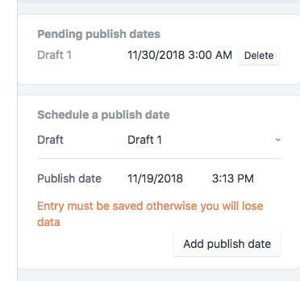

# Publisher 

Craft Publisher enables you to publish saved Drafts on a future date without 
the need to handle the cache expiration logic. 
The cronjob handles the publication and the cache invalidation.

It also handles entries which are to expire or published in the 
future correctly and will invalidate the cache.



## Installation

Install using `composer require goldinteractive/craft3-publisher` and install in Craft.

## Setup

Setup a Cron Job which runs *every minute*.

Call it via CLI or web:

Web:
```shell
* * * * * /usr/bin/curl --silent --compressed {siteUrl}/actions/publisher/api/publish
```

CLI:
```shell
* * * * * [PATH_TO_CRAFT_INSTALLATION]/craft publisher/publish
```

## Usage

## What does not work?

Currently it is not possible to have a postDate in the future and a expire date in the future at the same time.
It is a possible feature for the roadmap but needs a bit of refactoring of the data model.